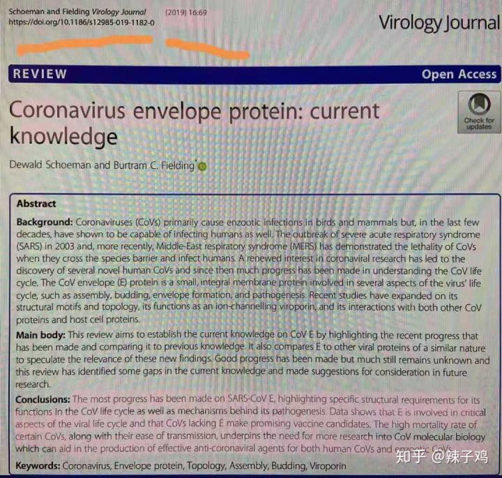

# 病毒样本可能来自某海鲜市场的活狼崽

新型肺炎的病毒样本可能来自某海鲜市场的活狼崽

有限人传人，携带病毒者可传染他人，被感染者感染的发病者可能无法再传染他人\(此条存疑

犬类为宿主，靠空气或接触传染，病犬十米范围内可以眼角膜感染，请尽量不要接触流浪狗

作者：辣子鸡  
链接：https://www.zhihu.com/question/367219889/answer/982065044  
来源：知乎  
著作权归作者所有。商业转载请联系作者获得授权，非商业转载请注明出处。  
  

总结一下

首先引用下柴静的话:"这不是在制造恐慌，比恐慌更可怕的是轻慢"三体的"无知不是生存的障碍，傲慢才是" 还请各位重视起来。

 一: 目前确诊319例，实际上会更多，专家之前在模型中就预测12号武汉感染人群为1700例，这已经22号了

 二: 病毒潜伏期最长12天，症状发热或咳嗽，不是特别明显，不容易发现\(非典是突然发热，症状明显，很容易发现\)，虽然现阶段传播力没有非典强，但不排除未来随着传播加快，病毒进化的可能，再加上春运期间人口流量大，聚会多，且大部分人未重视，可能病毒的隐性携带者会比较多，未来半个月内的确诊人数不是很乐观

 三: 冠状病毒目前为止并没有特效药，非典并没有治愈，而是因为当时开春天气转暖，非典病毒怕热消失了，并不是治愈。同为冠状病毒的nCoV，目前的治疗方案只有1.自体免疫，就是自己扛过去，2，糖皮质激素，副作用大，会造成股骨头坏死，骨头会和石膏一样，后半生十分难熬

 四: 一定要让家人和自己重视起来，戴口罩不只是为你自己负责，更是为他人负责，尽量不要去人多的地方，减少外出，\(武汉环境监测报告样本中nCoV呈阳性，且此病毒在大气中的存活时间目前未知\)

还请朋友们一定要重视起来！！！！望一切安好！

